# Fidelis Financial Management — Manual de Usuario

**Versión:** Julio 2026
**Aplicación:** fidelisfm.kingdomtechgroup.org

> Las capturas de pantalla de este manual usan datos de demostración. Los nombres, montos y cuentas que ves en tu sistema serán los de tu organización.

---

## Índice

1. [Introducción](#1-introducción)
2. [Roles y permisos](#2-roles-y-permisos)
3. [Primeros pasos](#3-primeros-pasos)
4. [El menú principal](#4-el-menú-principal)
5. [Dashboard](#5-dashboard)
6. [Ingresos](#6-ingresos)
7. [Egresos](#7-egresos)
8. [Cheques](#8-cheques)
9. [Formato de cheques](#9-formato-de-cheques)
10. [Depósitos](#10-depósitos)
11. [Conciliación bancaria](#11-conciliación-bancaria)
12. [Reportes](#12-reportes)
13. [Presupuesto](#13-presupuesto)
14. [Admin Center: Auditoría](#14-auditoría)
15. [Admin Center: Tendencias](#15-tendencias)
16. [Admin Center: Automatizaciones](#16-automatizaciones)
17. [Admin Center: Usuarios](#17-usuarios)
18. [Asistente de Inteligencia Artificial](#18-asistente-de-inteligencia-artificial)
19. [Preguntas frecuentes](#19-preguntas-frecuentes)

---

## 1. Introducción

**Fidelis Financial Management** es el sistema de administración financiera de la iglesia. Permite registrar ingresos (diezmos, ofrendas, donaciones) y egresos, preparar depósitos bancarios, emitir e imprimir cheques, conciliar las cuentas contra el estado del banco, generar reportes financieros formales y planificar el presupuesto anual.

El sistema funciona desde cualquier navegador moderno (computadora, tableta o celular). No requiere instalar nada.

---

## 2. Roles y permisos

Cada usuario tiene un rol que determina qué pantallas puede ver y usar:

| Pantalla | Administrador | Tesorero | Auditor |
|---|:---:|:---:|:---:|
| Dashboard | ✅ | ✅ | — |
| Ingresos | ✅ | ✅ | ✅ |
| Egresos | ✅ | ✅ | ✅ |
| Cheques / Formato de cheques | ✅ | ✅ | — |
| Depósitos | ✅ | ✅ | — |
| Conciliación | ✅ | ✅ | — |
| Reportes | ✅ | ✅ | — |
| Presupuesto | ✅ (solo cuentas Founder) | — | — |
| Auditoría | ✅ | — | ✅ |
| Tendencias | ✅ | — | — |
| Automatizaciones | ✅ | — | — |
| Usuarios | ✅ | — | — |

- **Administrador** — acceso completo, incluido el Admin Center y la creación de usuarios.
- **Tesorero** — operación financiera diaria: ingresos, egresos, cheques, depósitos, conciliación y reportes.
- **Auditor** — acceso de revisión: puede ver Ingresos, Egresos y el historial de Auditoría.

---

## 3. Primeros pasos

### 3.1 Iniciar sesión

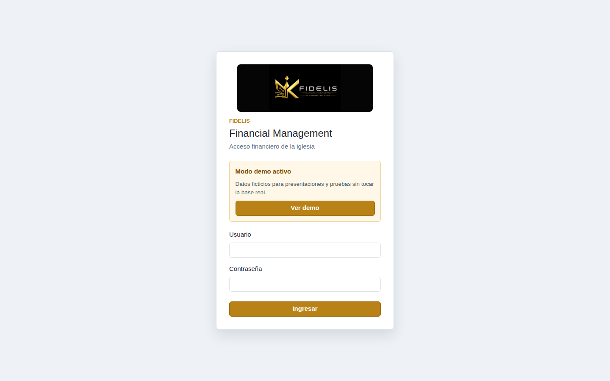

1. Abre el navegador y entra a la dirección de la aplicación.
2. Escribe tu **usuario** y **contraseña**.
3. Haz clic en **Ingresar**.

### 3.2 Primera vez: establecer tu contraseña

Cuando el administrador crea tu cuenta, recibirás un **correo de bienvenida** con un enlace para establecer tu contraseña:

1. Abre el correo "Bienvenido a Fidelis Financial Management" y haz clic en **Establecer contraseña**.
2. Escribe tu nueva contraseña dos veces (mínimo **8 caracteres**).
3. Haz clic en **Guardar contraseña** y luego inicia sesión normalmente.

> El enlace del correo expira en 48 horas. Si expiró, pide al administrador que te envíe uno nuevo desde la pantalla de Usuarios.

Si el administrador te entregó una **contraseña temporal** en lugar de un correo, el sistema te pedirá cambiarla la primera vez que inicies sesión, antes de poder usar la aplicación.

### 3.3 ¿Olvidaste tu contraseña?

Pide al administrador que te envíe un **enlace de restablecimiento** desde la pantalla **Usuarios** (botón "Enviar enlace"). El enlace llega a tu correo y es válido por 48 horas.

### 3.4 Cerrar sesión

Haz clic en **Salir**, en la esquina superior derecha, junto a tu nombre.

---

## 4. El menú principal

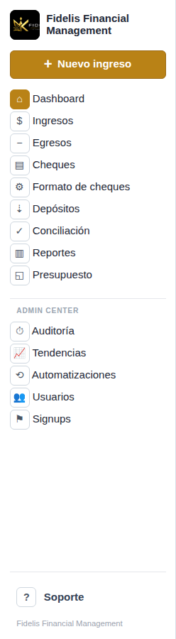

El menú de la izquierda tiene tres áreas:

- **Botón "+ Nuevo ingreso"** — acceso directo para registrar un diezmo u ofrenda.
- **Operación diaria** — Dashboard, Ingresos, Egresos, Cheques, Formato de cheques, Depósitos, Conciliación, Reportes y Presupuesto.
- **ADMIN CENTER** — herramientas administrativas: Auditoría, Tendencias, Automatizaciones, Usuarios y Signups. Esta sección solo aparece para los roles que tienen acceso a al menos una de sus opciones.

En celulares el menú se muestra en la parte superior en dos columnas.

---

## 5. Dashboard

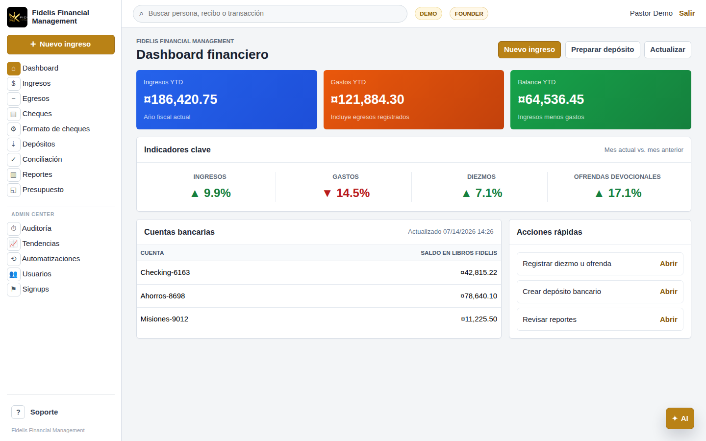

Es la pantalla de inicio. Muestra de un vistazo:

- **Ingresos YTD / Gastos YTD / Balance YTD** — totales acumulados del año fiscal actual.
- **Indicadores clave** — comparación porcentual del mes actual contra el mes anterior (ingresos, gastos, diezmos, ofrendas). Verde con flecha arriba = mejoró; rojo con flecha abajo = bajó.
- **Cuentas bancarias** — saldo en libros de cada cuenta según lo registrado en Fidelis. *Este saldo puede diferir del saldo real del banco hasta que concilies.*
- **Acciones rápidas** — accesos directos a registrar ingresos, crear depósitos y revisar reportes.

---

## 6. Ingresos

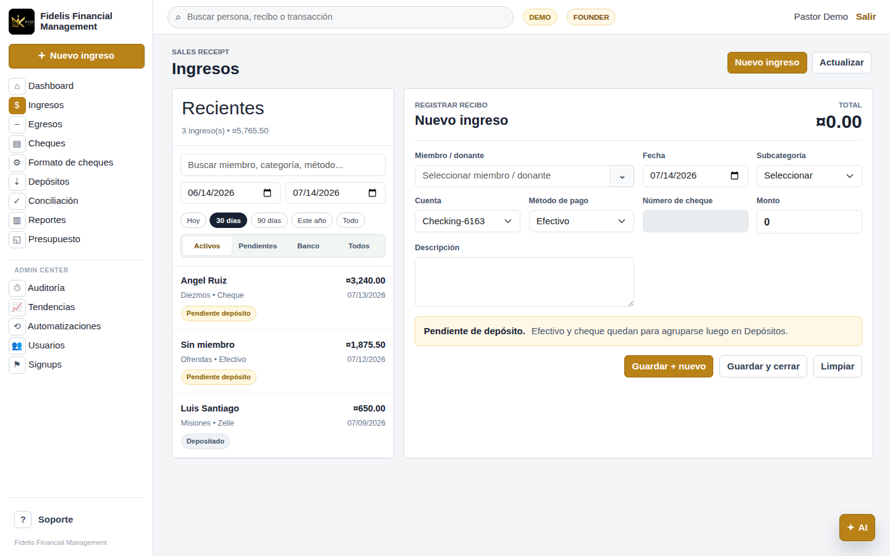

Aquí se registran diezmos, ofrendas, donaciones y cualquier dinero que entra.

### 6.1 Registrar un ingreso

En el panel derecho **"Nuevo ingreso"**:

1. **Miembro / donante** — selecciona a la persona (opcional; útil para el reporte de diezmos). Si no existe, puedes crearla desde el mismo selector.
2. **Fecha** — día en que se recibió el dinero.
3. **Subcategoría** — tipo de ingreso (Diezmos, Ofrendas, Misiones, etc.).
4. **Cuenta** — cuenta bancaria a la que pertenecerá.
5. **Método de pago** — Efectivo, Cheque, Zelle, ACH, Tarjeta o Transferencia. Si eliges *Cheque*, el **número de cheque** es obligatorio.
6. **Monto** y **Descripción**.
7. Haz clic en **Guardar + nuevo** (para seguir registrando) o **Guardar y cerrar**.

> **Pendiente de depósito:** el efectivo y los cheques quedan marcados "Pendiente depósito" hasta que los agrupes en la pantalla de **Depósitos**. Los métodos electrónicos (Zelle, ACH) entran directo al banco.

### 6.2 Buscar ingresos anteriores

En el panel izquierdo **"Recientes"**:

- **Caja de búsqueda** — filtra por miembro, categoría o método.
- **Fechas** — al cambiar cualquier fecha la lista se actualiza sola.
- **Botones rápidos** — *Hoy*, *30 días*, *90 días*, *Este año*, *Todo* (todo el historial).
- **Pestañas** — *Activos*, *Pendientes* (de depósito), *Banco* (ya depositados), *Todos*.

### 6.3 Anular un ingreso

Abre el ingreso desde la lista y usa la opción de anular, indicando el motivo. Los ingresos ya **depositados o conciliados no se pueden modificar** — primero habría que anular el depósito.

---

## 7. Egresos

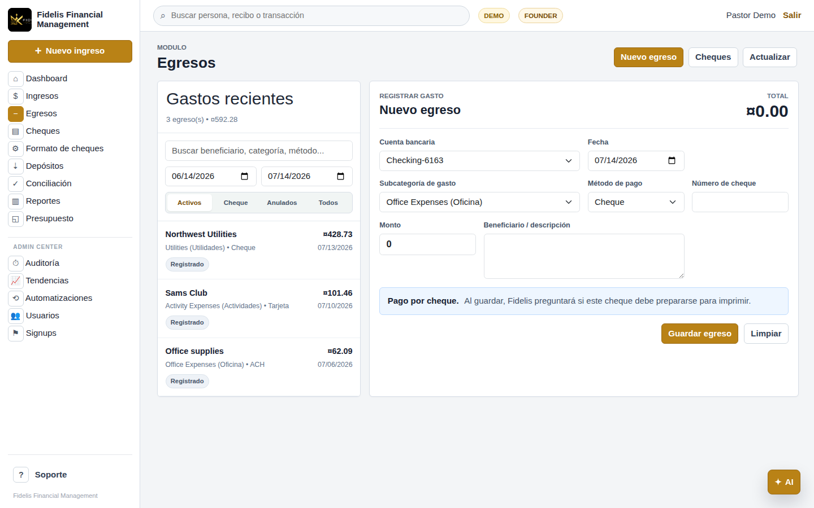

Registra todo el dinero que sale: pagos de servicios, compras, ayudas, etc.

1. Completa **fecha, subcategoría de gasto, cuenta, método de pago, monto y descripción**.
2. Si el pago fue con **cheque**, indica el número — así podrás generar el voucher en la pantalla de Cheques sin duplicar el gasto.
3. Guarda. El egreso se descuenta del saldo en libros de la cuenta.

Igual que en Ingresos, la lista de recientes permite buscar y filtrar por fechas, y los egresos pueden anularse con motivo (queda registrado en Auditoría).

---

## 8. Cheques

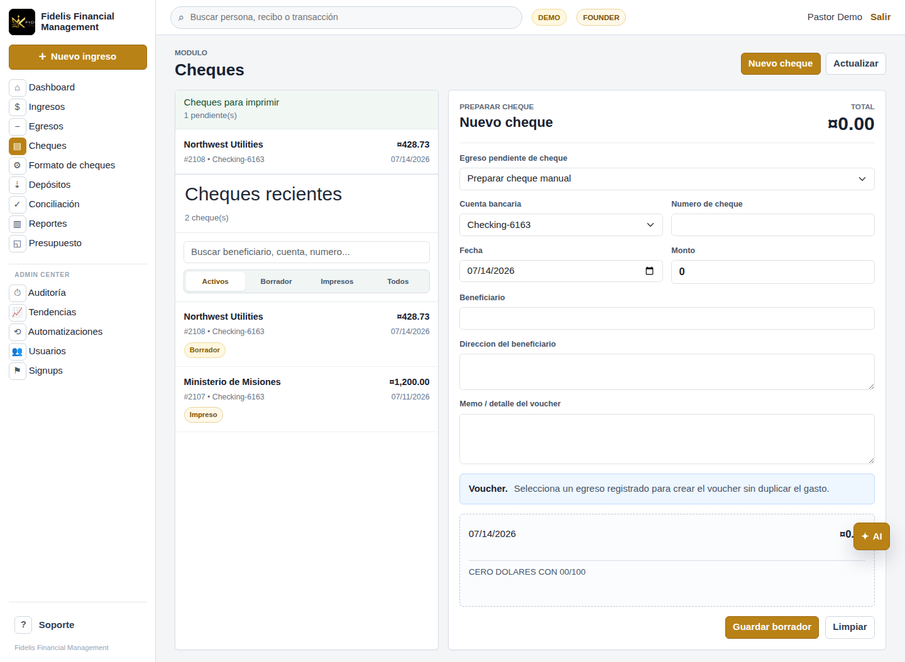

Prepara e imprime cheques físicos de la iglesia.

### 8.1 Crear un cheque

En el panel **"Nuevo cheque"**:

1. **Egreso pendiente de cheque** — si el gasto ya fue registrado en Egresos con método *Cheque*, selecciónalo aquí. Esto crea el voucher **sin duplicar el gasto**. También puedes elegir *Preparar cheque manual*.
2. Completa **cuenta bancaria, número de cheque, fecha, monto, beneficiario y dirección** (la dirección aparece en la ventana del sobre).
3. El **memo / detalle del voucher** es lo que se imprime como concepto.
4. Abajo verás la **vista previa** del cheque, incluyendo el monto en letras generado automáticamente.
5. Haz clic en **Guardar borrador**.

### 8.2 Imprimir

- El panel **"Cheques para imprimir"** (arriba a la izquierda) lista los borradores pendientes.
- Al imprimir, el cheque cambia de estado *Borrador* → *Impreso*.
- La lista **"Cheques recientes"** permite buscar por beneficiario, cuenta o número, y filtrar por estado (*Activos, Borrador, Impresos, Todos*).
- Un cheque también puede **anularse** con motivo.

---

## 9. Formato de cheques

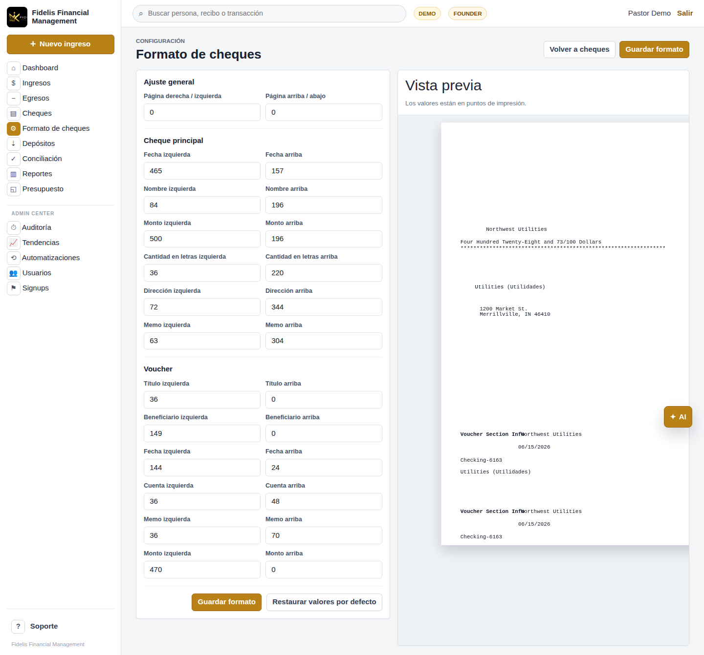

Aquí se calibra la posición de cada elemento (fecha, beneficiario, monto, monto en letras, memo, dirección) para que coincida exactamente con el papel de cheques pre-impreso de tu banco.

**Consejo:** imprime primero una prueba en papel normal, ponla contra un cheque real a contraluz, y ajusta los milímetros hasta que todo caiga en su lugar. Los ajustes se guardan por organización — solo hay que calibrar una vez.

---

## 10. Depósitos

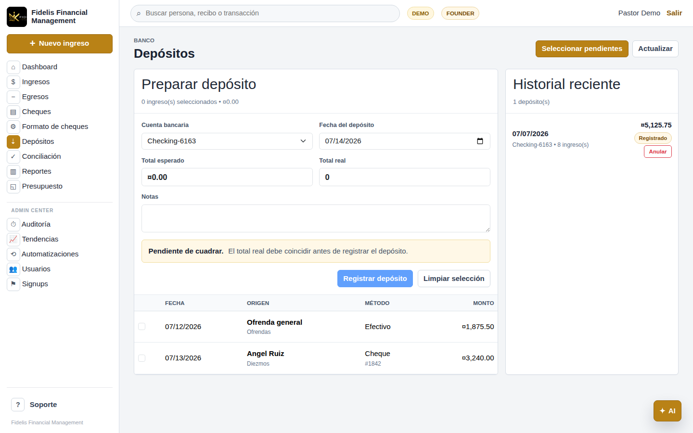

Agrupa el efectivo y los cheques recibidos en un **depósito bancario**, tal como lo llevas físicamente al banco.

### 10.1 Preparar un depósito

1. En la tabla inferior aparecen los **ingresos pendientes** (efectivo y cheques aún no depositados). Marca con ✔ los que vas a llevar al banco, o usa **Seleccionar pendientes** para marcarlos todos.
2. Elige la **cuenta bancaria** y la **fecha del depósito**.
3. El **Total esperado** se calcula solo con los ingresos marcados. Escribe el **Total real** (lo que efectivamente vas a depositar). Ambos deben coincidir — el sistema muestra "Cuadrado" en verde cuando coinciden.
4. Haz clic en **Registrar depósito**.

El depósito suma al saldo en libros de la cuenta y los ingresos incluidos cambian de "Pendiente depósito" a "Depositado".

### 10.2 Historial y anulación

El panel **"Historial reciente"** (a la derecha en escritorio; **primero** en celular) muestra los depósitos registrados. El botón **Anular** libera los ingresos incluidos y resta el monto del saldo — pide un motivo que queda en Auditoría.

---

## 11. Conciliación bancaria

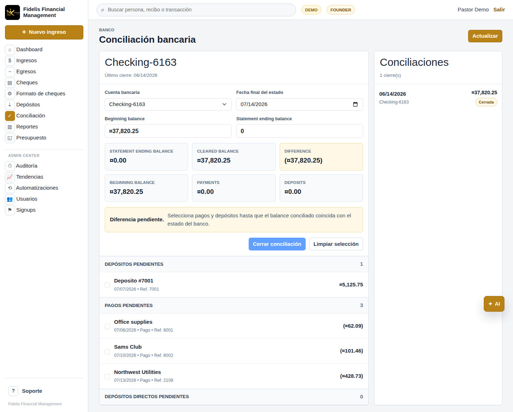

La conciliación confirma que lo registrado en Fidelis coincide con el **estado de cuenta del banco**. Se recomienda hacerla cada mes al recibir el estado.

1. Selecciona la **cuenta bancaria** y la **fecha final del estado** de cuenta.
2. Escribe el **Statement ending balance** (saldo final que muestra el estado del banco). El *Beginning balance* viene del último cierre.
3. En las listas de **Depósitos pendientes** y **Pagos pendientes**, marca ✔ cada movimiento que aparece en el estado del banco.
4. Observa la tarjeta **DIFFERENCE**: cuando llegue a **$0.00**, todo cuadra.
5. Haz clic en **Cerrar conciliación**. El cierre queda en el historial de la derecha y los movimientos conciliados ya no pueden modificarse.

> Si la diferencia no llega a cero, revisa: cargos bancarios no registrados en Fidelis (regístralos como egreso), depósitos en tránsito, o montos digitados distintos a los del banco.

---

## 12. Reportes

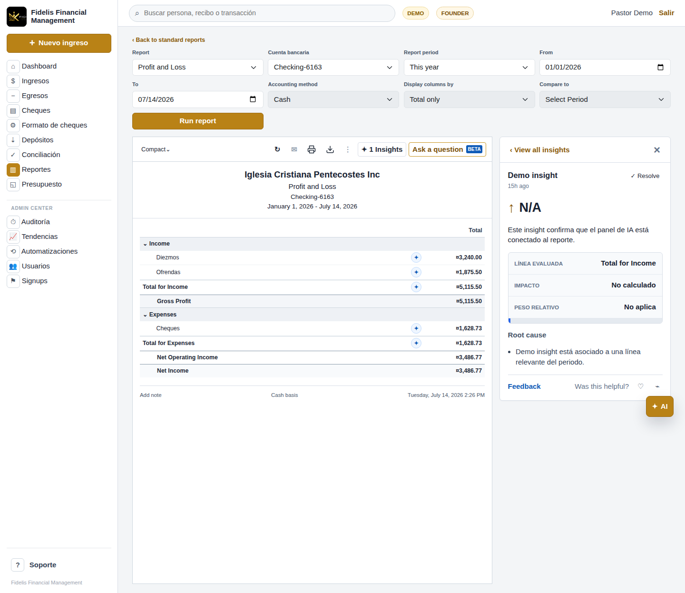

Reportes financieros formales, listos para imprimir o guardar como PDF.

### 12.1 Reportes disponibles

- **Profit and Loss** — resumen de ingresos y gastos por categoría, con Gross Profit, Net Operating Income y Net Income.
- **Profit and Loss Detail** — igual que el anterior, pero cada subcategoría se puede **expandir** para ver las transacciones individuales.
- **Diezmos (Miembros que diezman)** — miembros con diezmos registrados en el periodo.

### 12.2 Filtros

- **Report** — cuál reporte generar.
- **Cuenta bancaria** — una cuenta específica o *Todas las cuentas*.
- **Report period** — This month, Last month, This year, o fechas personalizadas (From/To).
- Haz clic en **Run report**.

### 12.3 Profit and Loss Detail: ver las transacciones

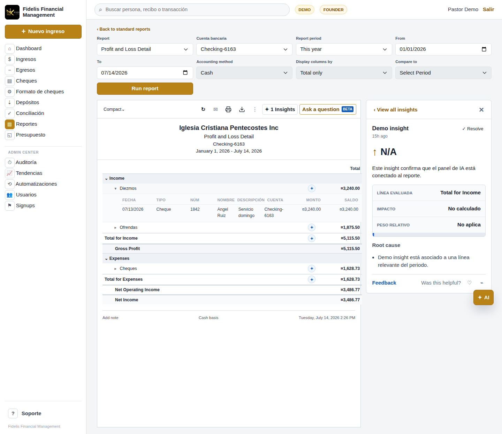

En el reporte Detail, cada subcategoría muestra una flecha **▸**. Haz clic sobre la línea para expandirla: verás cada transacción con **Fecha, Tipo, Número, Nombre, Descripción, Cuenta, Monto y Saldo** (acumulado dentro de la subcategoría). Vuelve a hacer clic para colapsar.

### 12.4 Imprimir o guardar PDF

Usa los íconos de **imprimir/descargar** en la barra del reporte. Se abre la vista formal con encabezado de la organización, líneas de firma (Pastor y Tesorería) y pie de página. En el diálogo de impresión del navegador elige **Guardar como PDF** si lo quieres en archivo. En el reporte Detail, la versión impresa incluye **todas las transacciones expandidas** automáticamente.

### 12.5 Insights

El panel derecho muestra **insights automáticos**: los totales del periodo, las partidas de mayor peso y advertencias (por ejemplo, si los gastos superan el 85% de los ingresos).

---

## 13. Presupuesto

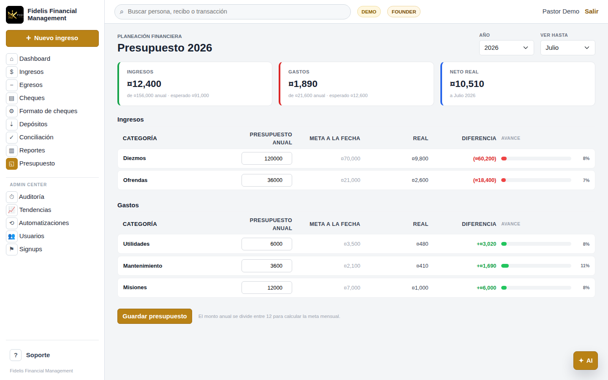

*Disponible solo para cuentas Founder, con rol Administrador o Tesorero.*

Planifica cuánto esperas recibir y gastar por categoría durante el año, y compáralo contra lo real.

### 13.1 Configurar el presupuesto anual

1. Elige el **Año**.
2. En la columna **Presupuesto anual**, escribe el monto que planeas para cada categoría de ingreso y de gasto.
3. Haz clic en **Guardar presupuesto**.

### 13.2 Leer la comparación

- **Ver hasta** — selecciona el mes: el sistema prorratea la meta (anual ÷ 12 × meses transcurridos) y suma lo real de enero hasta ese mes.
- **Meta a la fecha** — lo que "deberías" llevar a ese punto del año.
- **Real** — lo efectivamente registrado en las transacciones.
- **Diferencia** — verde es favorable (gasto por debajo del plan, o ingreso por encima); rojo es desfavorable.
- **Barra de avance** — porcentaje del presupuesto anual consumido: verde = en línea, ámbar = ligeramente desviado, rojo = desviación mayor al 15%.

Las tarjetas superiores resumen ingresos, gastos y neto real acumulado.

---

## 14. Auditoría

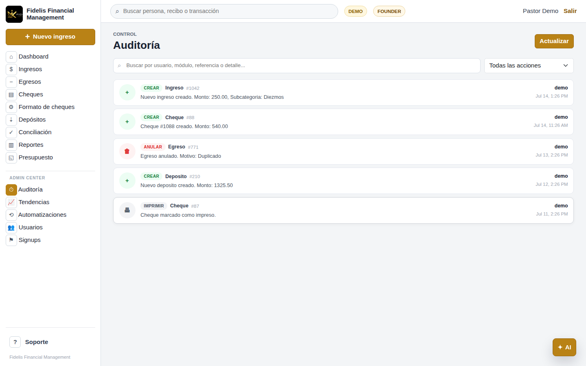

*Admin Center — roles Administrador y Auditor.*

Registro cronológico de **quién hizo qué y cuándo**: creaciones, ediciones, anulaciones, impresiones de cheques, ejecuciones de automatizaciones y cambios de presupuesto.

- Cada evento muestra un **ícono y etiqueta de color** según la acción: verde = crear, azul = editar, rojo = anular, naranja = ejecutar, gris = imprimir.
- **Buscador** — filtra por usuario, módulo, referencia o texto del detalle.
- **Filtro de acciones** — muestra solo un tipo de acción (ej. solo ANULAR).

Este historial no se puede editar ni borrar desde la aplicación — es el rastro de control interno de la iglesia.

---

## 15. Tendencias

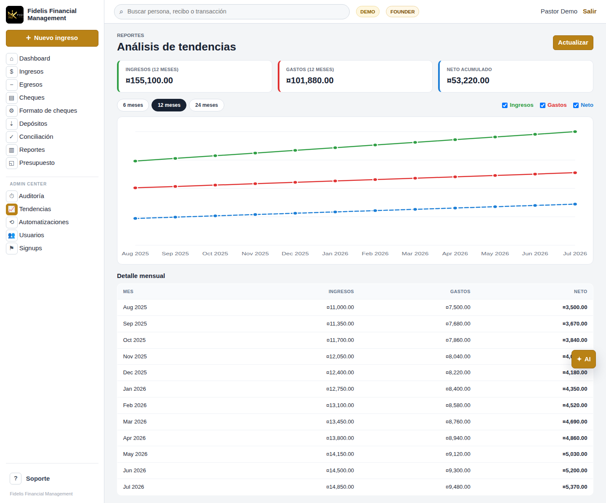

*Admin Center — rol Administrador.*

Gráfica de la evolución mensual de **ingresos (verde), gastos (rojo) y neto (azul punteado)**.

- **Tarjetas superiores** — totales de ingresos, gastos y neto acumulado del rango elegido.
- **Rango** — 6, 12 o 24 meses.
- **Casillas Ingresos/Gastos/Neto** — muestra u oculta cada línea.
- **Pasa el cursor** sobre un mes para ver los valores exactos en un tooltip.
- La tabla **Detalle mensual** muestra los números mes a mes, con el neto en verde o rojo según el signo.

---

## 16. Automatizaciones

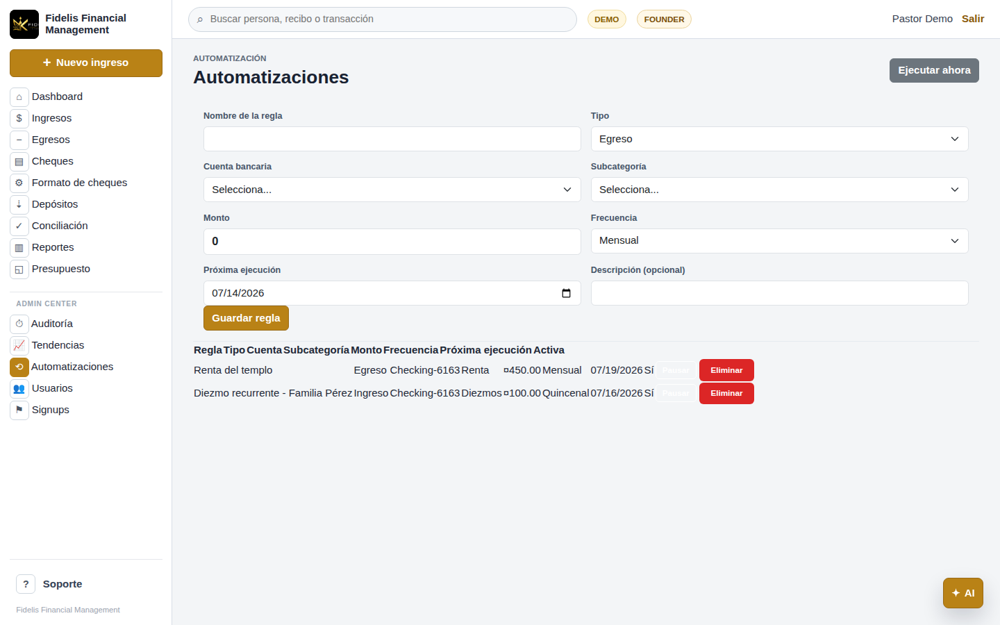

*Admin Center — rol Administrador.*

Crea **transacciones recurrentes** que se generan solas: renta mensual, servicios, diezmos comprometidos, etc.

1. Define **nombre, tipo (Ingreso/Egreso), cuenta, subcategoría, monto, frecuencia** (Semanal, Quincenal o Mensual) y la **próxima fecha de ejecución**.
2. Haz clic en **Guardar regla**.
3. El botón **Ejecutar ahora** procesa todas las reglas vencidas: crea la transacción real y avanza la fecha a la siguiente ocurrencia.
4. Cada regla puede **pausarse** o **eliminarse** desde la tabla.

Cada ejecución queda registrada en Auditoría.

---

## 17. Usuarios

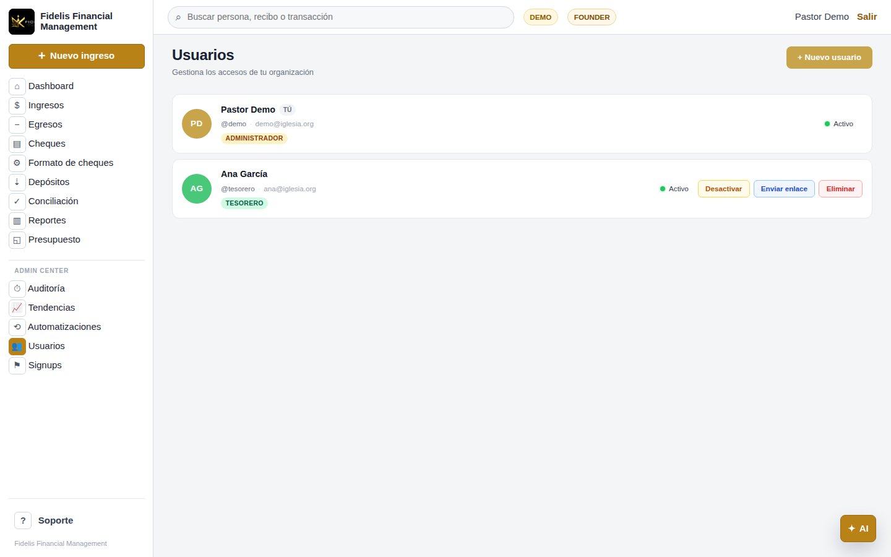

*Admin Center — solo rol Administrador.*

Administra quién tiene acceso al sistema.

### 17.1 Crear un usuario

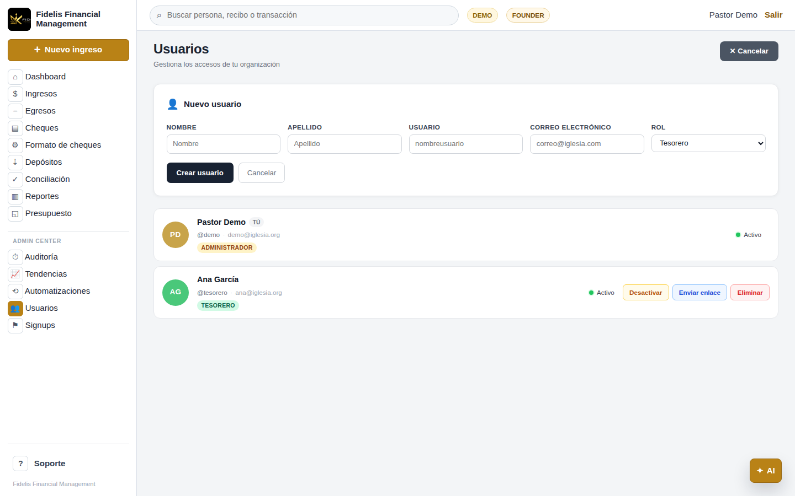

1. Haz clic en **+ Nuevo usuario**.
2. Completa **nombre, apellido, usuario, correo electrónico** y elige el **rol** (Administrador, Tesorero o Auditor — ver [sección 2](#2-roles-y-permisos)).
3. Haz clic en **Crear usuario**.
4. Si escribiste un correo, la persona recibe automáticamente el **correo de bienvenida** con el enlace para establecer su contraseña (válido 48 horas).

### 17.2 Administrar usuarios existentes

Cada tarjeta de usuario muestra su avatar (color según rol), nombre, usuario, correo, roles y estado, con tres acciones:

- **Desactivar / Activar** — un usuario desactivado no puede iniciar sesión (sus registros históricos se conservan). Es la opción recomendada cuando alguien deja de servir en el área.
- **Enviar enlace** — envía al correo del usuario un enlace para restablecer su contraseña.
- **Eliminar** — borra el usuario permanentemente (pide confirmación). Prefiere *Desactivar* salvo que la cuenta se haya creado por error.

> No puedes desactivarte ni eliminarte a ti mismo — tu propia tarjeta muestra "(tú)".

---

## 18. Asistente de Inteligencia Artificial

En cualquier pantalla verás el botón dorado **✦ AI** en la esquina inferior derecha. Ábrelo para hacer preguntas en lenguaje natural sobre las finanzas:

- *"¿Cuál es el balance en libros por cuenta?"*
- *"Resume el Profit and Loss de este año"*
- *"¿Qué gastos debo revisar primero?"*

El asistente responde usando **solo los datos reales de Fidelis** (saldos, reporte P&L e insights del periodo) y distingue siempre entre saldo en libros y saldo real del banco. Cada plan tiene un límite mensual de preguntas.

---

## 19. Preguntas frecuentes

**El saldo del Dashboard no coincide con el banco.**
Es normal: el Dashboard muestra el saldo *en libros* (lo registrado en Fidelis). Puede haber cheques emitidos que el banco aún no cobra, o depósitos en tránsito. La pantalla de **Conciliación** es donde se cuadran ambos.

**Registré un ingreso en efectivo y no aparece en el saldo del banco.**
El efectivo y los cheques quedan "Pendiente de depósito" hasta que los agrupes y registres en **Depósitos**. Ahí es cuando suman al saldo de la cuenta.

**No puedo editar un ingreso.**
Los ingresos ya **depositados o conciliados** están protegidos. Si necesitas corregirlo, primero anula el depósito (Depósitos → Historial → Anular), corrige, y vuelve a preparar el depósito.

**No veo alguna pantalla del menú.**
El menú se filtra por tu rol (ver [sección 2](#2-roles-y-permisos)). Si necesitas acceso adicional, pide al Administrador que revise tu rol en **Usuarios**.

**El enlace de mi correo de bienvenida expiró.**
Pide al Administrador que use **Enviar enlace** en tu tarjeta de la pantalla Usuarios — recibirás un enlace nuevo.

**¿Cómo saco un reporte para la reunión administrativa?**
Reportes → elige *Profit and Loss* → periodo (ej. *This year*) → **Run report** → ícono de imprimir → Guardar como PDF. La versión impresa incluye las líneas de firma del Pastor y Tesorería.

**Necesito ayuda adicional.**
Usa el enlace **Soporte** al pie del menú (soporte@fidelisfm.com).
